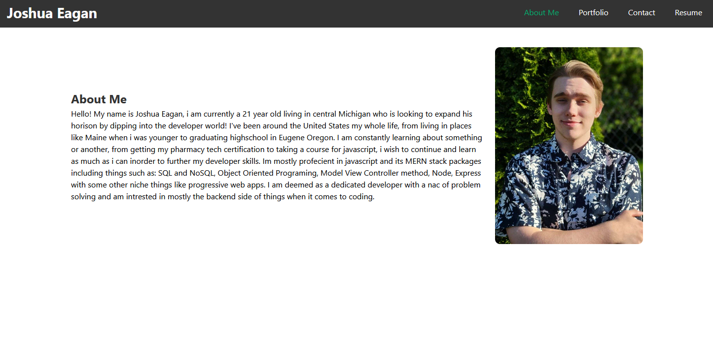

  # React Portfolio

## Description
This project consists of my main portfolio page using react, it showcases the so far works in my developer world and allows me a place to showcase my work and continuing projects. Here you will see an about me page, a place to list my projects, a resume page and a contact form.

Here is the live deployed link on netlify: 
## Table of Contents
- [Installation](#installation)
- [Usage](#usage)
- [License](#license)
- [Tests](#tests)
- [Questions](#questions)

## Installation
1. download current repository
2. run 'npm i' in the github repo folder
3. Start deployment with 'npm run start'

## Usage
To showcase my works of art and my progress as a developer.

## License
This project is licensed under the MIT license.
For more information, please visit https://opensource.org/licenses/MIT

## Tests
Tests on both the email validation and error handling of the contact page.

## Questions
For any questions, please contact me at [JoshuaPEagan@outlook.com](mailto:JoshuaPEagan@outlook.com).

GitHub: [KaiserGandros](https://github.com/KaiserGandros)
